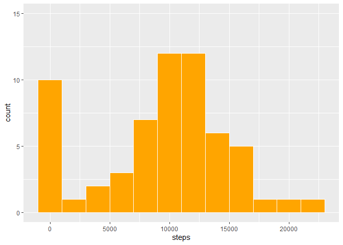
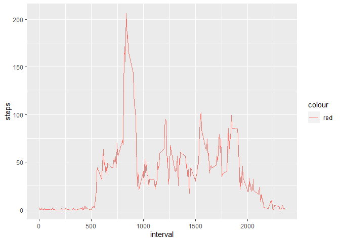
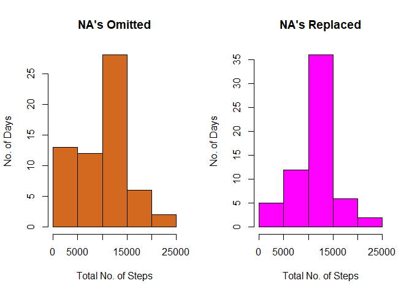
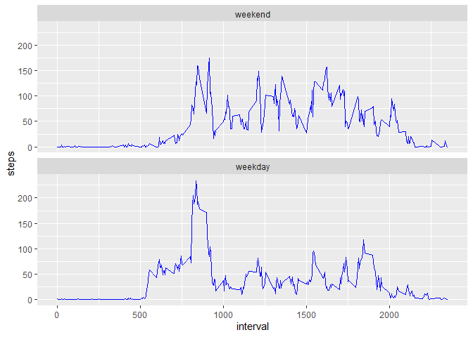

## Loading and preprocessing the data


```r
library(dplyr)
```

```
## 
## Attaching package: 'dplyr'
```

```
## The following objects are masked from 'package:stats':
## 
##     filter, lag
```

```
## The following objects are masked from 'package:base':
## 
##     intersect, setdiff, setequal, union
```

```r
library(ggplot2)

dfActivity <- read.csv("activity.csv",header=TRUE)
dfActivity$date <- as.Date(dfActivity$date)
dfActivity$steps <- as.numeric(dfActivity$steps)
dfActivity$interval <- as.numeric(dfActivity$interval)

dfActivity.steps <- dfActivity %>% group_by(date) %>% summarise(steps=sum(steps,na.rm = T))
```

## What is mean total number of steps taken per day?

```r
ggplot(dfActivity.steps, aes(x=steps)) +  geom_histogram(binwidth=2000,fill="orange",color="white")+
  ylim(0,15)
```

<!-- -->


```r
dfActivity %>% summarise(Mean=mean(dfActivity$steps,na.rm = T),Median=median(dfActivity$steps,na.rm = T))
```

```
##      Mean Median
## 1 37.3826      0
```

## What is the average daily activity pattern?

```r
dfActivity.avgsteps <- dfActivity %>% group_by(interval) %>% summarise(steps=mean(steps,na.rm = T))
```


```r
ggplot(dfActivity.avgsteps, aes(x=interval, y=steps,col="red")) + geom_line()
```

<!-- -->

## The 5-minute interval that, on average, contains the maximum number of steps

```r
dfActivity.avgsteps[which.max(dfActivity.avgsteps$steps), ]
```

```
## # A tibble: 1 x 2
##   interval steps
##      <dbl> <dbl>
## 1      835  206.
```

## Imputing missing values
### Total number of missing values in the dataset

```r
sum(is.na(dfActivity))
```

```
## [1] 2304
```

### Replace the missing values in the dataset with the Mean

```r
dfActivity$stepsnew <- dfActivity$steps
dfActivity$stepsnew[is.na(dfActivity$stepsnew)] <- mean(dfActivity$steps,na.rm = T)
```

### Histogram for the New dataset with values replaced.

```r
par(mfrow = c(1,2))
dfActivity.stepsNew <- dfActivity %>% group_by(date) %>% summarise(steps=sum(stepsnew))
```


```r
par(mfrow = c(1,2))
hist(dfActivity.steps$steps,xlab="Total No. of Steps",ylab="No. of Days",main="NA's Omitted",col="chocolate")
hist(dfActivity.stepsNew$steps,xlab="Total No. of Steps",ylab="No. of Days",main="NA's Replaced",col="magenta")
```

<!-- -->

## Are there differences in activity patterns between weekdays and weekends?

```r
weekdays <- c('Monday', 'Tuesday', 'Wednesday', 'Thursday', 'Friday')
dfActivity$wday <- factor(weekdays(as.Date(dfActivity$date)) %in% weekdays, levels=c(FALSE, TRUE),labels=c('weekend', 'weekday'))
dfActivity.wday <- dfActivity %>% group_by(interval,wday) %>% summarise(steps=mean(steps,na.rm = T))
```


```r
ggplot(dfActivity.wday, aes(x=interval, y=steps))+ geom_line(color="blue")+facet_wrap(~dfActivity.wday$wday,  ncol=1)
```

<!-- -->

